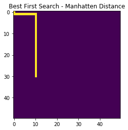
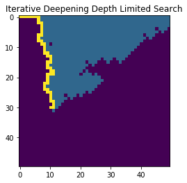
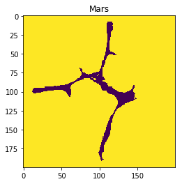
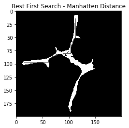
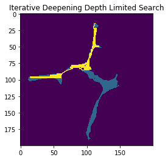
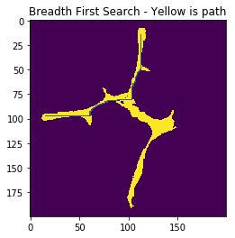

# Rover Pathfinding Notebook

This notebook is used for developing and testing the pathfinding algorithms used in aiding a simulated Mars Rover around a Mars Canyon in Udacity's Introduction to Robotics course. 

I wrote this notebook to test the algorithms before implementing them in the simulator to ensure they worked correctly. 


```python
%matplotlib inline
#%matplotlib qt 
# Make some of the relevant imports
import cv2 # OpenCV for perspective transform
import numpy as np
import matplotlib.image as mpimg
import matplotlib.pyplot as plt
import scipy.misc # For saving images as needed
import glob  # For reading in a list of images from a folder
import imageio
```

## Utility Functions

An important note about how these algorithms check which part of the map is navigable:
Each algorithm asks for a "worldmap". The worldmap must be a 2D numpy array. Navigable regions must be labeled as "1", obstacle regions must be labeled as "2" and unknown regions must be labeled as "0". 


```python
class PathNode():
    def __init__(self,pos,parent):
        self.pos = pos
        self.parent = parent
        
def isExplorable(pos,worldmap,exploredMap,frontierList):
    # TODO: Expand this conditional to include checking for obstacles and navigable 
    # areas of the worldmap
    if(exploredMap[pos] == 0 and (worldmap[pos] == 1)):
        for check in frontierList:
            if(check.pos == pos):
                return False
        return True
    else:
        return False
# returns a list of points that form a solution path
def getPathSolution( node ):
    solution = []
    while(node != None):
        solution.insert(0,node.pos)
        node = node.parent
    return solution
# adds neighbors to the frontier list if those neighborList
# are explorable
def addNeighborsToList(node,worldmap,exploredMap,frontierList):
    posX = node.pos[0]
    posY = node.pos[1]
    # really this is to the right
    if(posY < worldmap.shape[1]-1):
        north = (posX,posY+1)
        if(isExplorable(north,worldmap,exploredMap,frontierList)):
            frontierList.append(PathNode(north,node))
    # down
    if(posX < worldmap.shape[0]-1):
        east = (posX+1,posY)
        if(isExplorable(east,worldmap,exploredMap,frontierList)):
            frontierList.append(PathNode(east,node))
    # to the left
    if(posY>0):
        south = (posX,posY-1)
        if(isExplorable(south,worldmap,exploredMap,frontierList)):
            frontierList.append(PathNode(south,node))
    #up
    if(posX > 0):
        west = (posX-1,posY)
        if(isExplorable(west,worldmap,exploredMap,frontierList)):
            frontierList.append(PathNode(west,node))
```

### This section is for Breadth-First-Search. A heuristic search is used in place of this one, but this forms the foundation of the algorithm.


```python
def BFS_no_cycles(rootPos, goalPos, worldmap, debugPrint=False):
    frontierList= []
    root = PathNode(rootPos,None)
    exploredMap = np.zeros((worldmap.shape[0],worldmap.shape[1]))
    # expand current node and add to frontierList
    expandNodeBFS(root,worldmap,exploredMap,frontierList)
    # search
    goalState = False
    iteration = 0
    depth = 0
    solution = []
    while((not goalState) and (len(frontierList) > 0)):
        #print("iteration: "+ str(iteration))
        iteration = iteration + 1
        #select and expand
        nextNode = frontierList.pop(0)
        #print("Expanding: ",best[0],",",best[1])
        if nextNode.pos == goalPos:
            goalState = True
        else:
            expandNodeBFS(nextNode,worldmap,exploredMap,frontierList)
        if(goalState == True):
            print("Goal! Total Iterations: "+str(iteration))
            return exploredMap, getPathSolution(nextNode)
    return exploredMap,solution

# this function used to be much bigger...
def expandNodeBFS(node,worldmap,exploredMap,frontierList):
    exploredMap[node.pos] = 1
    addNeighborsToList(node,worldmap,exploredMap,frontierList)
```

## This section is for Greedy Best-First Search. 
This uses Manhattan-distance as a heuristic to evaluate each node when adding a node to the search frontier. Each time a node is added to the search frontier, the frontier is sorted to ensure the node with least distance to the goal is evaluated first. Because the path from each node to its neighbors is constant in the grid system, this should be essentially the best we can do without knowing much else about the environment.


```python
def GreedyBFS(rootPos,goalPos,worldmap):
    frontierList = []
    root = PathNode(rootPos,None)
    exploredMap = np.zeros(worldmap.shape)
    expandNodeBFS(root,worldmap,exploredMap,frontierList)
    frontierList = sorted(frontierList,key=lambda node:np.linalg.norm(np.array(node.pos)-np.array(goalPos)))
    goalState = False
    iteration = 0
    depth = 0
    solution = []
    while((not goalState) and (len(frontierList) > 0)):
        #print("iteration: "+ str(iteration))
        iteration = iteration + 1
        #select and expand
        nextNode = frontierList.pop(0)
        #print("Expanding: ",best[0],",",best[1])
        if nextNode.pos == goalPos:
            goalState = True
        else:
            expandNodeBFS(nextNode,worldmap,exploredMap,frontierList)
            frontierList = sorted(frontierList,key=lambda node:np.sum(np.absolute(np.array(node.pos)-np.array(goalPos))))
        if(goalState == True):
            print("Goal! Total Iterations: "+str(iteration))
            return exploredMap, getPathSolution(nextNode)
    return exploredMap, solution

```

## This section is for iterative-deepening depth-limited search. 
This search is the best when we have no idea about the search space that we want to explore. It was an interesting test for the rover, but we will not be using it.


```python
def IDDFS_no_cycles(rootPos,goalPos,worldmap, debugPrint=True):
    maxDepth = 900
    for d in range(maxDepth):
        goalState= False
        frontierList=[PathNode(rootPos,None)]
        solution=[]
        exploredMap = np.zeros(worldmap.shape)
        finalNode = depthLimitedSearch(worldmap,exploredMap,frontierList,goalPos,d)
        #print("Finished searching at depth: "+str(d))
        if(finalNode):
            print("Goal!")
            goalState=True
            solution = getPathSolution(finalNode)
        if((d==maxDepth-1) or goalState):
            return exploredMap,solution
            break

def depthLimitedSearch(worldmap,exploredMap,frontierList,goalPos,depth):
    if(depth == 0):
        node = frontierList.pop()
        #exploredList.append(node)
        #print("Exploring end node,"+str(node))
        exploredMap[node.pos] = 1
        if( node.pos == goalPos):
            return node

    if( depth > 0):
        node = frontierList.pop()
        #exploredList.append(node)
        #print("Exploring     node,"+str(node))
        exploredMap[node.pos] = 1
        if(node.pos == goalPos):
            return node
        posX = node.pos[0]
        posY = node.pos[1]
        # really this is to the right
        if(posY < worldmap.shape[1]-1):
            north = (posX,posY+1)
            if(isExplorable(north,worldmap,exploredMap,frontierList)):
                frontierList.append(PathNode(north,node))
                finalNode = depthLimitedSearch(worldmap,exploredMap,frontierList,goalPos,depth-1)
                if(finalNode):
                    return finalNode
        # down
        if(posX < worldmap.shape[0]-1):
            east = (posX+1,posY)
            if(isExplorable(east,worldmap,exploredMap,frontierList)):
                frontierList.append(PathNode(east,node))
                finalNode = depthLimitedSearch(worldmap,exploredMap,frontierList,goalPos,depth-1)
                if(finalNode):
                    return finalNode
        # to the left
        if(posY>0):
            south = (posX,posY-1)
            if(isExplorable(south,worldmap,exploredMap,frontierList)):
                frontierList.append(PathNode(south,node))
                finalNode = depthLimitedSearch(worldmap,exploredMap,frontierList,goalPos,depth-1)
                if(finalNode):
                    return finalNode
        #up
        if(posX > 0):
            west = (posX-1,posY)
            if(isExplorable(west,worldmap,exploredMap,frontierList)):
                frontierList.append(PathNode(west,node))
                finalNode = depthLimitedSearch(worldmap,exploredMap,frontierList,goalPos,depth-1)
                if(finalNode):
                    return finalNode
        return None
```

# Testing 

In this section we test the algorithms on open 50x50 worlds and on the actual map.


```python
worldmap_shape = (50,50)
worldmap = np.ones(worldmap_shape)
startPos = (0,0)
goalPos = (30,10)
```


```python
print("Start Greedy Best First Search.")
bfsmap, bfs_solution = GreedyBFS(startPos,goalPos,worldmap)
print("Starting Iterative Deepening DFS")
iddfsmap,dfs_solution=IDDFS_no_cycles(startPos,goalPos,worldmap)
print("Starting Breadth First Search.")
breadthfsmap, breadth_solution = BFS_no_cycles(startPos,goalPos,worldmap)
```

    Start Greedy Best First Search.
    Goal! Total Iterations: 40
    Starting Iterative Deepening DFS
    Goal!
    Starting Breadth First Search.
    Goal! Total Iterations: 850
    


```python
for pix in bfs_solution:
    bfsmap[pix] = 3

for pix in dfs_solution:
    iddfsmap[pix] = 3
```


```python
plt.figure()
plt.title("Best First Search - Manhatten Distance")
plt.imshow(bfsmap)
plt.figure()
plt.title("Iterative Deepening Depth Limited Search")
plt.imshow(iddfsmap)
```


    <matplotlib.image.AxesImage at 0x1e44853e278>








```python
mars_map = mpimg.imread('../calibration_images/map_bw.png')
mars_start = (97,16)
mars_goal = (15,113)

# here we need to convert the mars map to our input standard:
# 0 - unknown, 1 - navigable, 2- obstacle.
# there will be no unknowns in this map

mars_map[mars_map == 0] = 2

# run the searches on the mars map
print("Start Greedy Best First Search.")
bfsmap, bfs_solution = GreedyBFS(mars_start,mars_goal,mars_map)
print("Starting Iterative Deepening DFS")
iddfsmap,dfs_solution=IDDFS_no_cycles(mars_start,mars_goal,mars_map)
print("Starting Breadth First Search.")
breadthfsmap, breadth_solution = BFS_no_cycles(mars_start,mars_goal,mars_map)


bfsmap[mars_map==1] = breadthfsmap[mars_map==1] = 10

if(len(bfs_solution) > 0):
    for pix in bfs_solution:
        bfsmap[pix] = 3

if(len(dfs_solution)>0):
    for pix in dfs_solution:
        iddfsmap[pix] = 3
        
if(len(breadth_solution)>0):
    for pix in breadth_solution:
        breadthfsmap[pix] = 3
```

    Start Greedy Best First Search.
    Goal! Total Iterations: 181
    Starting Iterative Deepening DFS
    Goal!
    Starting Breadth First Search.
    Goal! Total Iterations: 1616
    


```python
plt.figure()
plt.title("Mars")
plt.imshow(mars_map)
plt.figure()
plt.title("Best First Search - Manhatten Distance")
plt.imshow(bfsmap,cmap='gray')
plt.figure()
plt.title("Iterative Deepening Depth Limited Search")
plt.imshow(iddfsmap)
plt.figure()
plt.title("Breadth First Search - Yellow is path")
plt.imshow(breadthfsmap)


```


    <matplotlib.image.AxesImage at 0x1e448687390>














## Functions for controlling Rover autonomously

This section has functions that help the rover follow the paths generated by the algorithms.


```python
targetQ1 = (5,5)
targetQ2 = (-5,5)
targetQ3 = (-5,-5)
targetQ4 = (5,-5)
roverPos = (0,0)
targets = [targetQ1,targetQ2,targetQ3,targetQ4]

def distToTarget(targetPos):
    return np.linalg.norm(np.array(targetPos)-np.array(roverPos))

def targetYaw(targetPos):
    arct = np.arctan( (targetPos[1]-roverPos[1])/(targetPos[0]-roverPos[0]))*180/np.pi
    if targetPos[0] > roverPos[0] and targetPos[1] > roverPos[1]:
        return arct
    elif targetPos[0] > roverPos[0]: 
        return 360+arct
    elif targetPos[1] > roverPos[1]:
        return 180+arct
    else:
        return 180+arct
    
def turnToTargetYaw(targetYaw):
    currYaw = 170
    dist = targetYaw-currYaw
    if(dist>180):
        dist = -(360-dist)
    return dist
    
for tar in targets:
    print(distToTarget(tar))
    print(targetYaw(tar))
    print(turnToTargetYaw(targetYaw(tar)))
    

    

```

    7.07106781187
    45.0
    -125.0
    7.07106781187
    135.0
    -35.0
    7.07106781187
    225.0
    55.0
    7.07106781187
    315.0
    145.0
    


```python

```


```python

```
